***
title: "Software Engineering Project Report"
author: "Group 03"
***

# Software Engineering Project Report
## Smart Home Automation System — Group 03

***
## 1. Group Info

| Field | Details |
|---|---|
| **Group Number** | Group 03 |
| **Case Study** | Smart Home Automation System |
| **Course** | Software Engineering |
| **Instructor** | *Dr.Samer Elkababji* |

### Team Members

| Name | Student ID |
|---|---|
| Abdulrhman Atassi | *20210651* |
| Sarah Shobaki | *20220188* |
| Osama Zaid | *20220099* |
| Mariam Laith | *20220872* |

***

## 2. Overview

### System Purpose

The Smart Home Automation System is an IoT-based platform designed to integrate and control smart home devices including thermostats, lighting, security cameras, and alarms. The system enables homeowners and family members to monitor and manage their home environment through mobile and web applications, supporting remote device control, automation routines, and real-time alerts for sensor-triggered events. An embedded AI/ML module learns user behavior patterns to optimize energy efficiency and comfort over time.

### Tools Used

| Tool | Purpose |
|---|---|
| PlantUML | All UML and C4 diagram generation |
| Visual Studio Code | Report and source file editing |
| GitHub | Version control and collaboration |

***

## 3. Diagrams
 
### Part I — Context
 
| ID | Diagram | File | Description |
|---|---|---|---|
| C4-L1 | System Context Diagram | `uml/c4_l1_context.puml` | Shows all actors and external systems interacting with the Smart Home Automation System |
| C4-L2 | Container Diagram | `uml/c4_l2_container.puml` | Breaks the system into deployable containers: clients, API gateway, backend services, IoT gateway, and data layer |
| AD1 | Activity Diagram — Device Control | `uml/ad1_device_control.puml` | Models the end-to-end flow when a user issues a device control command |
| AD2 | Activity Diagram — Automation & AI | `uml/ad2_automation_ai.puml` | Models the background automation trigger and AI suggestion flow |
| AD3 | Activity Diagram — Onboarding | `uml/ad3_onboarding.puml` | Models user registration and device onboarding flow |
| AD4 | Activity Diagram — Alert Response | `uml/ad4_alert_response.puml` | Models the incident detection and emergency response flow |
| AD5 | Activity Diagram — Manage Family | `uml/ad5_manage_family.puml` | Models the homeowner's flow for adding and managing family member accounts |
| AD6 | Activity Diagram — Admin Monitoring | `uml/ad6_admin_monitoring.puml` | Models the system administrator's monitoring and configuration flow |
 
### Part II — Interactions
 
| ID | Diagram | File | Description |
|---|---|---|---|
| UC1 | Use Case Diagram — Users | `uml/uc1_user_interactions.puml` | All use cases available to Homeowner and Family Member |
| UC2 | Use Case Diagram — System & Admin | `uml/uc2_system_admin.puml` | Use cases for System Administrator, Automation Engine, and AI/ML Service |
| SD1 | Sequence Diagram — High Level | `uml/sd1_highlevel.puml` | Stakeholder-level view of the device control flow |
| SD2 | Sequence Diagram — Device Control | `uml/sd2_device_control_detailed.puml` | Detailed developer-level view of device control including cache, DB, and IoT protocol |
| SD3 | Sequence Diagram — Automation & AI | `uml/sd3_automation_detailed.puml` | Detailed flow of sensor-triggered automation and AI pattern recognition |
| SD4 | Sequence Diagram — Onboarding | `uml/sd4_onboarding_detailed.puml` | Detailed flow of user registration and device handshake |
| SD5 | Sequence Diagram — Alert Response | `uml/sd5_alert_detailed.puml` | Detailed flow of anomaly detection, emergency actions, and incident resolution |
| SD6 | Sequence Diagram — Family Member | `uml/sd6_family_member_detailed.puml` | Detailed flow of adding a family member and propagating device permissions |
| SD7 | Sequence Diagram — Admin | `uml/sd7_admin_detailed.puml` | Detailed flow of admin system health monitoring and configuration actions |
 
### Part III — Structure
 
| ID | Diagram | File | Description |
|---|---|---|---|
| CD1 | Class Diagram | `uml/class_diagram.puml` | Full domain model with attributes, operations, generalization, aggregation, and composition |
 
### Part IV — Behavior
 
| ID | Diagram | File | Description |
|---|---|---|---|
| ST1 | State Diagram — Device Lifecycle | `uml/state_diagram_device.puml` | Models all states a device can be in and the events that trigger transitions — event-driven dimension |
| DFD0 | DFD Level 0 — Context | `uml/dfd_l0_context.puml` | System-level data flow context showing external entities and data in/out |
| DFD1 | DFD Level 1 — Data Pipeline | `uml/dfd_l1_pipeline.puml` | Detailed data management pipeline covering user data, device data, AI learning, and reporting |
 
***
 
## 4. Repository Structure
 
```
/
├── README.md                             # This file — also embedded as report title page
├── docs/
│   ├── report.md                         # Full project report in Markdown
│   └── report.pdf                        # Final report converted via Pandoc
└── uml/
    ├── c4_l1_context.puml                # C4 Level 1 — System Context
    ├── c4_l2_container.puml              # C4 Level 2 — Container Diagram
    ├── ad1_device_control.puml           # Activity Diagram 1 — Device Control
    ├── ad2_automation_ai.puml            # Activity Diagram 2 — Automation & AI
    ├── ad3_onboarding.puml               # Activity Diagram 3 — Onboarding
    ├── ad4_alert_response.puml           # Activity Diagram 4 — Alert Response
    ├── ad5_manage_family.puml            # Activity Diagram 5 — Manage Family
    ├── ad6_admin_monitoring.puml         # Activity Diagram 6 — Admin Monitoring
    ├── uc1_user_interactions.puml        # Use Case Diagram 1 — Users
    ├── uc2_system_admin.puml             # Use Case Diagram 2 — System & Admin
    ├── sd1_highlevel.puml                # Sequence Diagram 1 — High Level
    ├── sd2_device_control_detailed.puml  # Sequence Diagram 2 — Device Control
    ├── sd3_automation_detailed.puml      # Sequence Diagram 3 — Automation & AI
    ├── sd4_onboarding_detailed.puml      # Sequence Diagram 4 — Onboarding
    ├── sd5_alert_detailed.puml           # Sequence Diagram 5 — Alert Response
    ├── sd6_family_member_detailed.puml   # Sequence Diagram 6 — Family Member
    ├── sd7_admin_detailed.puml           # Sequence Diagram 7 — Admin
    ├── class_diagram.puml                # Class Diagram — Full Domain Model
    ├── state_diagram_device.puml         # State Diagram — Device Lifecycle
    ├── dfd_l0_context.puml               # DFD Level 0 — Context
    └── dfd_l1_pipeline.puml              # DFD Level 1 — Data Pipeline
```
 
***
 
## 5. Contributions
 
### Member Roles
 
| Member | Role |
|---|---|
| Sarah | System Architect — C4 diagrams, container design |
| Abdulrhman | Interaction Modeler — Use case diagrams and descriptions |
| Mariam | Behavior Modeler — Activity diagrams |
| Osama | Sequence Modeler — Sequence diagrams and report |
 
### Commits Per Member
 
| Member | Commits |
|---|---|
| Sarah | *(32)* |
| Abdulrhman | *(18)* |
| Mariam | *(1)* |
| Osama | *(1)* |


***

## Table of Contents

1. System Description
2. Part I — Context
   - 2.1 C4 Level 1: System Context Diagram
   - 2.2 C4 Level 2: Container Diagram
   - 2.3 Activity Diagrams
3. Part II — Interactions
   - 3.1 Use Case Diagrams
   - 3.2 Use Case Descriptions
   - 3.3 Sequence Diagrams
4. Part III — Structure
   - 4.1 Class Diagram
5. Part IV — Behavior
   - 5.1 State Diagram
   - 5.2 Data Flow Diagram
6. Design Decisions and Assumptions
7. Traceability Matrix

***

## 1. System Description

The Smart Home Automation System is an IoT-based platform designed to integrate and centrally control smart home devices including thermostats, lighting systems, security cameras, door locks, and environmental sensors. The system serves multiple user roles within a household — a Primary Homeowner with full administrative control, and Family Members with scoped device access — alongside a System Administrator responsible for backend health and configuration.

The platform exposes its functionality through both a mobile application (iOS and Android) and a web application, allowing users to issue real-time device commands, configure automation rules, and receive instant alerts when sensor thresholds are exceeded. An embedded AI/ML module continuously analyzes per-user behavioral data to generate personalized automation suggestions and optimize energy consumption patterns without requiring manual input.

The system maintains a central database containing device configurations, user accounts, automation rules, behavioral logs, and incident records. A dedicated IoT Gateway translates between internet-facing HTTP/REST communication and physical device protocols including Zigbee, Bluetooth, and MQTT. A Redis-based device state cache ensures sub-millisecond read latency for real-time dashboard updates and automation rule evaluation.

The system is designed around four core operational flows: device control initiated by human actors, autonomous automation triggered by sensor events, user and device onboarding, and safety-critical incident detection and response. Each flow is fully modeled across all UML layers in this report.

***

## 2. Part I — Context

### 2.1 C4 Level 1: System Context Diagram

The C4 Level 1 diagram presents the Smart Home Automation System as a single black box surrounded by the actors and external systems that interact with it. This level answers the question: who uses the system and what does it depend on?

**Actors:**

- **Primary Homeowner** — the primary human actor with full control over devices, household members, and system settings
- **Family Member** — a registered household user with permissions scoped by the Homeowner to specific devices
- **System Administrator** — a technical operator responsible for system health, device configuration, and user management

**External Systems:**

- **Mobile / Web Application** — the frontend interface through which human actors interact with the system
- **IoT Devices** — the physical smart devices in the household: thermostats, lights, cameras, alarms, and sensors
- **Notification Service** — an external push/email delivery platform that dispatches alerts to users
- **AI/ML Module** — a learning module that analyzes usage patterns and generates automation suggestions
- **Authentication Service** — an OAuth 2.0 identity provider that validates user credentials

> **Design decision:** Guest User was explicitly excluded. The system is modeled as private to registered household members only. This is documented as a design assumption in Section 6.

**Diagram:** `uml/c4_l1_context.puml`

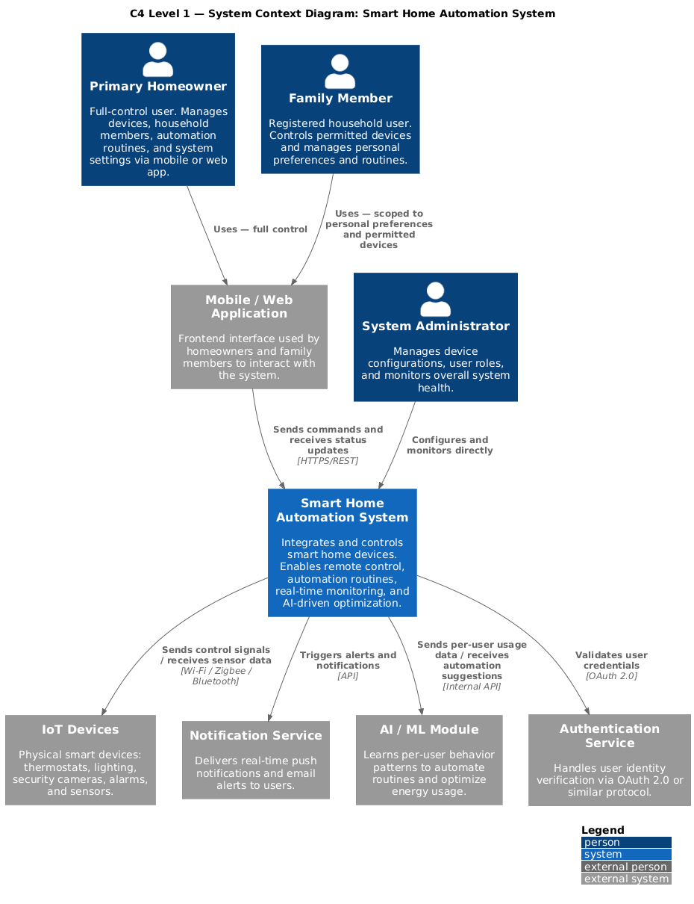

***

### 2.2 C4 Level 2: Container Diagram

The C4 Level 2 diagram opens the black box and reveals the major deployable components — containers — that make up the Smart Home Automation System, along with their communication protocols.

**Containers and design rationale:**

| Container | Type | Design Rationale |
|---|---|---|
| Mobile App | iOS/Android Client | Explicitly required by case study |
| Web Application | Browser Client | Explicitly required by case study |
| API Gateway | REST Entry Point | Centralizes authentication, rate limiting, and routing |
| User & Preference Service | Backend Service | Manages per-user profile data described in the case study |
| Device Management Service | Backend Service | Core domain service for device state, registration, and command dispatch |
| Automation Engine | Backend Service | Isolated from Device Management — rule evaluation logic is fundamentally different from device I/O |
| Notification Service | Backend Service | Internal dispatch layer before handing off to external push/email systems |
| IoT Gateway | Protocol Bridge | Required to translate between HTTP/REST and physical device protocols (Zigbee/MQTT) |
| AI/ML Service | ML Module | Integrated module per case study — lives inside the system boundary at L2 |
| Central Database | PostgreSQL | Explicitly required by case study for persistent storage |
| Device State Cache | Redis | Real-time device states require sub-millisecond reads — polling PostgreSQL directly is architecturally unsound |

**Diagram:** `uml/c4_l2_container.puml`

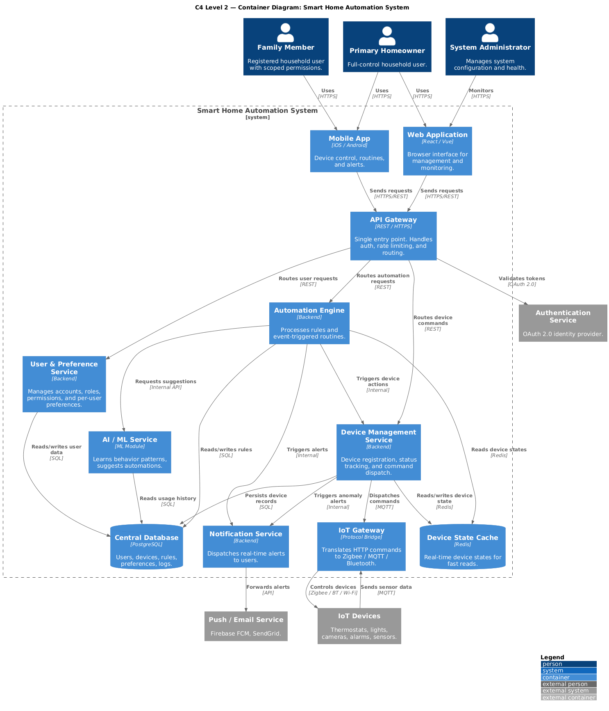

***

### 2.3 Activity Diagrams

Six activity diagrams are provided, each modeling a distinct process flow using swimlanes to represent actor and component responsibilities. The six flows were selected to achieve complete coverage of all actors, all containers defined in C4 L2, and all primary use cases.

#### Activity Diagram 1 — Device Control Flow

Models the primary real-time flow when a user issues a device control command. Covers the full path from user input through authentication, permission checking, IoT command dispatch, retry logic, and state persistence.

**Swimlanes:** Homeowner / Family Member, Mobile/Web App, API Gateway, Device Management Service, IoT Gateway

**Diagram:** `uml/ad1_device_control.puml`

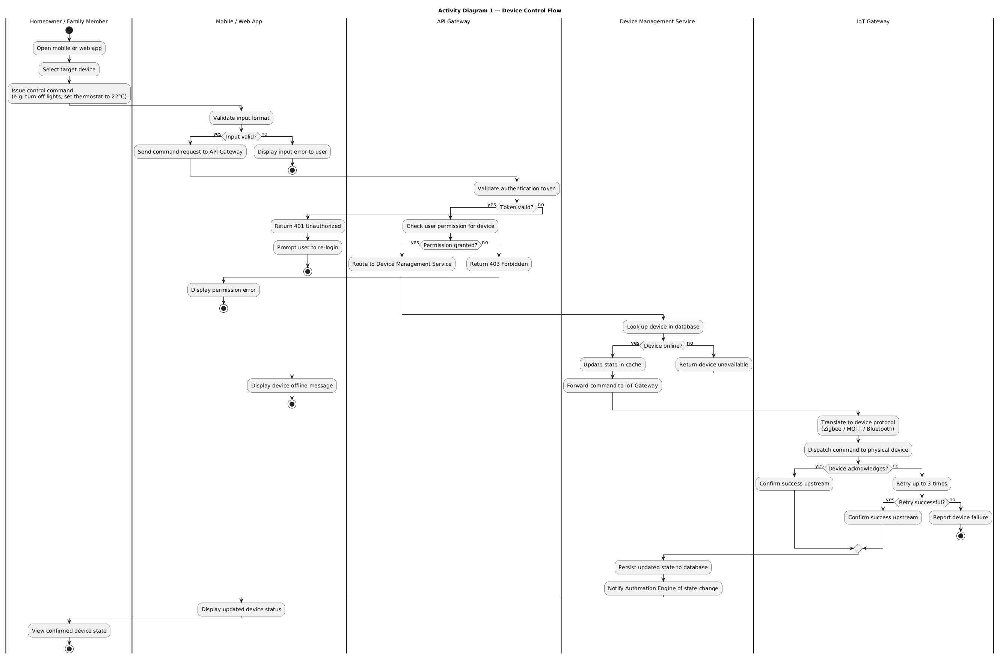

***

#### Activity Diagram 2 — Automation and AI Trigger Flow

Models the background intelligence layer initiated by a sensor event rather than a human. Covers Automation Engine rule evaluation, AI pattern analysis, and user-facing suggestion handling.

**Swimlanes:** IoT Gateway, Device Management Service, Automation Engine, AI/ML Service, Notification Service, Homeowner/Family Member

**Diagram:** `uml/ad2_automation_ai.puml`

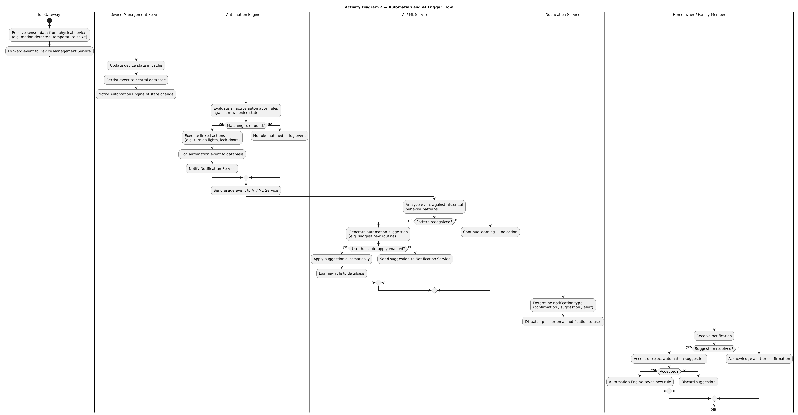

***

#### Activity Diagram 3 — User Registration and Device Onboarding

Models the system setup phase covering account creation, email verification, and the IoT Gateway handshake with a newly added physical device.

**Swimlanes:** New User, Mobile/Web App, API Gateway, User & Preference Service, Device Management Service, IoT Gateway

**Diagram:** `uml/ad3_onboarding.puml`

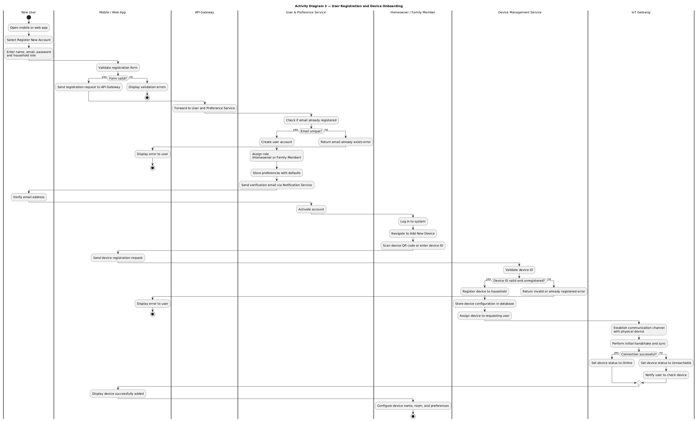

***

#### Activity Diagram 4 — Alert and Incident Response Flow

Models the safety-critical path covering anomaly detection from a physical sensor, emergency rule execution, user notification, false alarm handling with AI feedback, and incident resolution.

**Swimlanes:** IoT Device/Sensor, IoT Gateway, Device Management Service, Automation Engine, Notification Service, Homeowner/Family Member, AI/ML Service

**Diagram:** `uml/ad4_alert_response.puml`

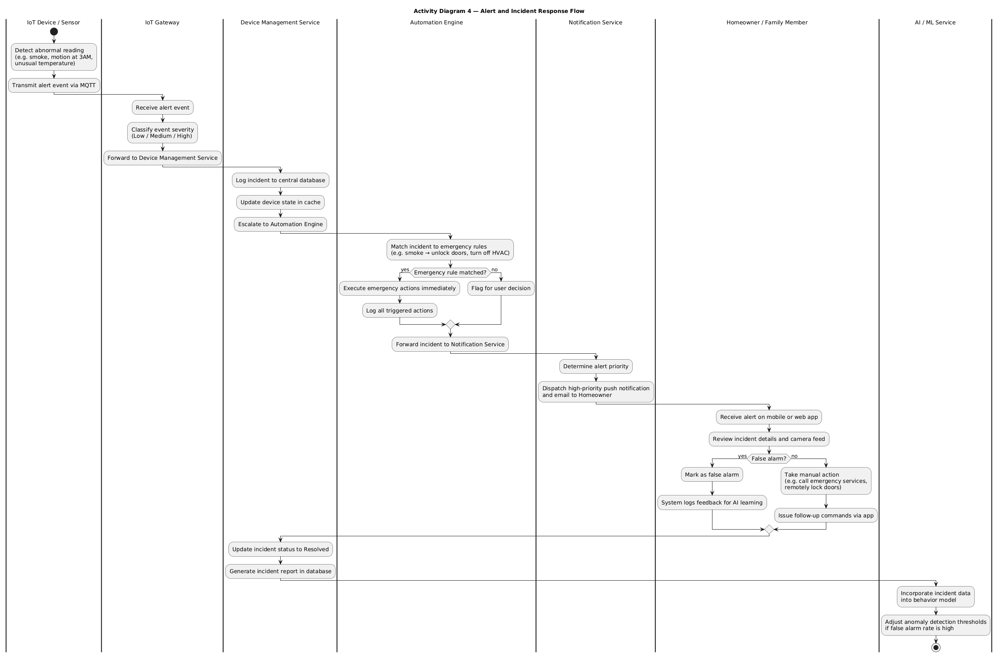

***

#### Activity Diagram 5 — Manage Family Members

Models the Homeowner's flow for adding a Family Member. This flow is architecturally significant because it involves permission propagation across the Device Management Service — not a trivial CRUD operation.

**Swimlanes:** Homeowner, Mobile/Web App, API Gateway, User & Preference Service, Device Management Service, Notification Service, New Family Member

**Diagram:** `uml/ad5_manage_family.puml`

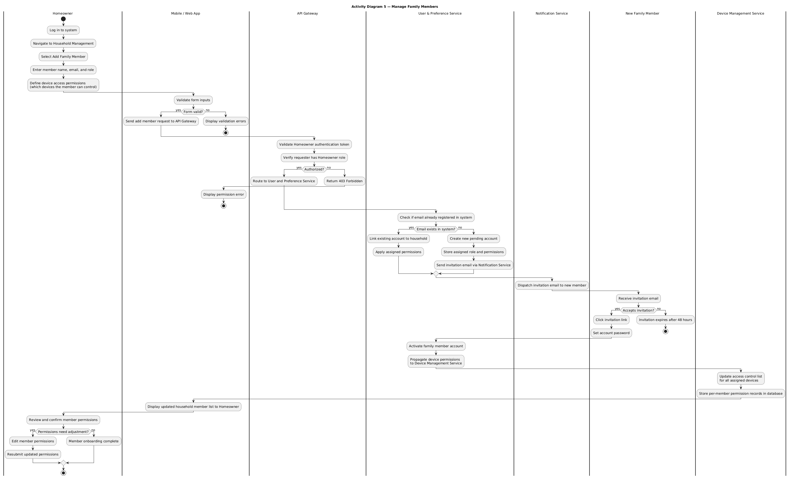

***

#### Activity Diagram 6 — System Administrator Monitoring and Configuration

Models the System Administrator's interaction pattern — no IoT layer involved, direct backend service access, administrative operations rather than device-driven flows.

**Swimlanes:** System Administrator, Web Application, API Gateway, Device Management Service, User & Preference Service, Automation Engine

**Diagram:** `uml/ad6_admin_monitoring.puml`

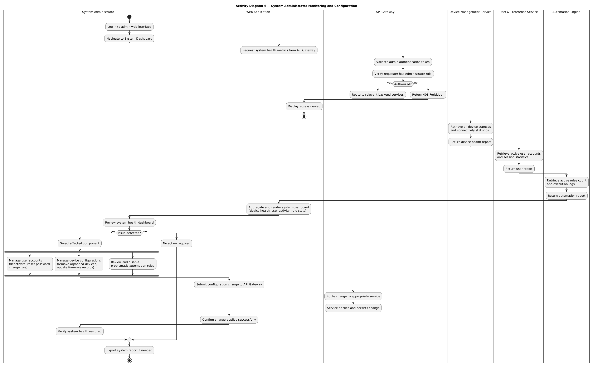

***

## 3. Part II — Interactions

### 3.1 Use Case Diagrams

Two use case diagrams are provided. The split separates human-actor use cases from system-actor and administrative use cases, preventing the diagram from becoming unreadable.

Actor-to-package associations are used in both diagrams for diagram clarity. Each actor interacts with all use cases within their associated package. This decision is explicitly documented here and in the diagram notes.

#### Use Case Diagram 1 — User Interactions

Covers all use cases accessible to the Homeowner and Family Member. The Homeowner has access to all packages. The Family Member is restricted to Devices, Monitoring, and Preferences.

**Diagram:** `uml/uc1_user_interactions.puml`

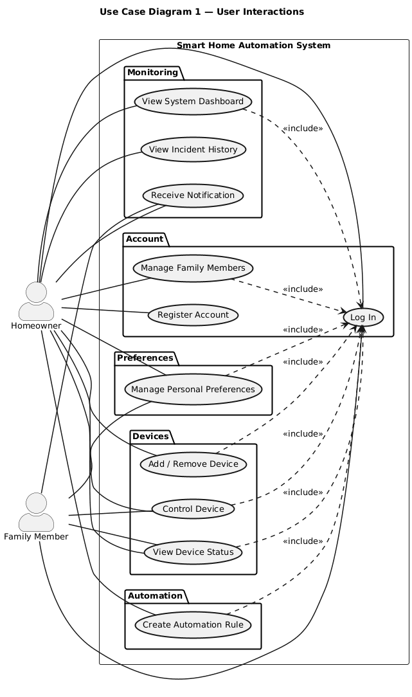

***

#### Use Case Diagram 2 — System and Admin Interactions

Covers use cases triggered by the System Administrator, Automation Engine, and AI/ML Service.

**Diagram:** `uml/uc2_system_admin.puml`

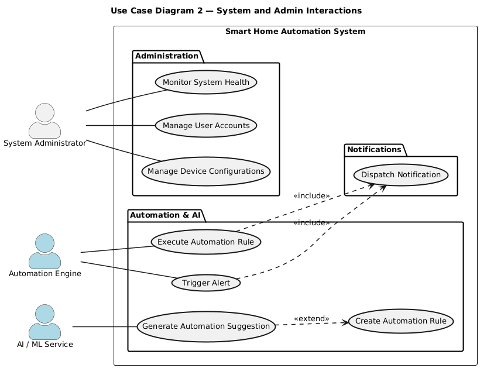

***

### 3.2 Use Case Descriptions

Detailed tabular descriptions are provided for the eight primary use cases — one per major functional area.

***

#### UC-01: Log In

| Field | Description |
|---|---|
| **Use Case ID** | UC-01 |
| **Use Case Name** | Log In |
| **Actor(s)** | Homeowner, Family Member |
| **Description** | A registered user authenticates into the system using their credentials to gain access to permitted features |
| **Preconditions** | User has a registered and verified account |
| **Postconditions** | User is authenticated and redirected to the system dashboard |
| **Main Flow** | 1. User opens mobile or web app. 2. User enters email and password. 3. App sends credentials to API Gateway. 4. API Gateway forwards to Authentication Service. 5. Authentication Service validates credentials and returns JWT token. 6. System grants access based on user role |
| **Alternate Flow** | 3a. Invalid credentials → system displays error and prompts retry. 3b. Account not verified → system prompts email verification |
| **Exceptions** | Account locked after 5 failed attempts. Network failure → system displays connection error |
| **Includes** | — |
| **Extends** | — |

***

#### UC-02: Control Device

| Field | Description |
|---|---|
| **Use Case ID** | UC-02 |
| **Use Case Name** | Control Device |
| **Actor(s)** | Homeowner, Family Member |
| **Description** | An authenticated user sends a control command to a smart device |
| **Preconditions** | User is logged in. Target device is registered and online. User has permission to control the target device |
| **Postconditions** | Device executes the command. State is updated in cache and database. User receives confirmation |
| **Main Flow** | 1. User selects target device. 2. User issues control command. 3. App sends request to API Gateway. 4. Gateway validates authentication and permission. 5. Device Management Service forwards command to IoT Gateway. 6. IoT Gateway translates and dispatches to physical device. 7. Device acknowledges command. 8. State updated in cache and database. 9. Confirmation sent to user |
| **Alternate Flow** | 7a. Device does not acknowledge → IoT Gateway retries up to 3 times. 7b. All retries fail → system reports device failure and triggers alert |
| **Exceptions** | Device offline → system displays offline message. Permission denied → system returns 403 error |
| **Includes** | UC-01 Log In |
| **Extends** | UC-06 Trigger Alert |

***

#### UC-03: Add / Remove Device

| Field | Description |
|---|---|
| **Use Case ID** | UC-03 |
| **Use Case Name** | Add / Remove Device |
| **Actor(s)** | Homeowner |
| **Description** | The homeowner registers a new smart device to the household or removes an existing one |
| **Preconditions** | User is logged in as Homeowner. For adding: device is physically powered and within communication range |
| **Postconditions** | Device is registered/removed in the central database. IoT Gateway establishes or terminates communication channel |
| **Main Flow** | 1. Homeowner navigates to device management. 2. Selects Add Device. 3. Scans QR code or enters device ID. 4. Device Management Service validates ID. 5. System registers device to household. 6. IoT Gateway performs handshake with physical device. 7. Device status set to Online. 8. Homeowner assigns name, room, and preferences |
| **Alternate Flow** | 4a. Device ID already registered → system returns conflict error. 6a. Handshake fails → device set to Unreachable, user notified |
| **Exceptions** | Invalid device ID → system rejects registration. Network failure during handshake → system prompts retry |
| **Includes** | UC-01 Log In |
| **Extends** | — |

***

#### UC-04: Create Automation Rule

| Field | Description |
|---|---|
| **Use Case ID** | UC-04 |
| **Use Case Name** | Create Automation Rule |
| **Actor(s)** | Homeowner |
| **Description** | The homeowner defines a trigger-based automation rule that instructs the system to perform device actions automatically when specified conditions are met |
| **Preconditions** | User is logged in as Homeowner. At least one device is registered |
| **Postconditions** | Automation rule is saved to database. Automation Engine begins evaluating rule against incoming events |
| **Main Flow** | 1. Homeowner navigates to automation settings. 2. Selects Create New Rule. 3. Defines trigger condition. 4. Defines action. 5. Saves rule. 6. System stores rule in database. 7. Automation Engine registers rule for evaluation |
| **Alternate Flow** | 5a. Rule conflicts with existing rule → system warns user and requests confirmation |
| **Exceptions** | Invalid trigger or action configuration → system displays validation error |
| **Includes** | UC-01 Log In |
| **Extends** | UC-08 Generate Automation Suggestion |

***

#### UC-05: Manage Family Members

| Field | Description |
|---|---|
| **Use Case ID** | UC-05 |
| **Use Case Name** | Manage Family Members |
| **Actor(s)** | Homeowner |
| **Description** | The homeowner adds, removes, or modifies household member accounts and assigns device access permissions |
| **Preconditions** | User is logged in as Homeowner |
| **Postconditions** | Family member account is created, updated, or removed. Permissions are propagated to the Device Management Service |
| **Main Flow** | 1. Homeowner navigates to household management. 2. Selects Add Member. 3. Enters member name and email. 4. Assigns role and device permissions. 5. System creates pending account and sends invitation email. 6. Member accepts invitation and sets password. 7. Account activated with assigned permissions. 8. Permissions propagated to Device Management Service |
| **Alternate Flow** | 3a. Email already registered → system links existing account to household. 6a. Invitation not accepted within 48 hours → invitation expires |
| **Exceptions** | Maximum household member limit reached → system rejects addition |
| **Includes** | UC-01 Log In |
| **Extends** | — |

***

#### UC-06: Trigger Alert

| Field | Description |
|---|---|
| **Use Case ID** | UC-06 |
| **Use Case Name** | Trigger Alert |
| **Actor(s)** | Automation Engine |
| **Description** | The Automation Engine detects an anomalous device event and dispatches a high-priority alert to the homeowner |
| **Preconditions** | A sensor event or device failure has occurred. Notification Service is operational |
| **Postconditions** | Alert is delivered to homeowner via push notification and/or email. Incident is logged to database |
| **Main Flow** | 1. Automation Engine detects anomalous event. 2. Classifies alert severity. 3. Forwards to Notification Service. 4. Notification Service dispatches push and email alert. 5. Homeowner acknowledges alert. 6. Incident logged to database |
| **Alternate Flow** | 4a. Push notification fails → system falls back to email only |
| **Exceptions** | Notification Service unavailable → incident logged locally and alert queued for retry |
| **Includes** | — |
| **Extends** | UC-02 Control Device |

***

#### UC-07: Execute Automation Rule

| Field | Description |
|---|---|
| **Use Case ID** | UC-07 |
| **Use Case Name** | Execute Automation Rule |
| **Actor(s)** | Automation Engine |
| **Description** | The Automation Engine evaluates active rules against incoming device state changes and executes matched actions automatically |
| **Preconditions** | At least one automation rule exists in the database. A device state change event has been received |
| **Postconditions** | Matched actions are executed. Execution is logged. User is notified if rule specifies notification |
| **Main Flow** | 1. Device state change received. 2. Automation Engine loads active rules. 3. Evaluates each rule against current state. 4. Identifies matching rules. 5. Dispatches action commands to Device Management Service. 6. Logs execution to database. 7. Sends confirmation notification if configured |
| **Alternate Flow** | 4a. No rule matches → engine logs event and takes no action |
| **Exceptions** | Rule references a deleted device → engine skips rule and flags it for review |
| **Includes** | — |
| **Extends** | — |

***

#### UC-08: Generate Automation Suggestion

| Field | Description |
|---|---|
| **Use Case ID** | UC-08 |
| **Use Case Name** | Generate Automation Suggestion |
| **Actor(s)** | AI / ML Service |
| **Description** | The AI/ML Service analyzes historical user behavior and device usage patterns to generate personalized automation rule suggestions |
| **Preconditions** | Sufficient usage history exists in the database. AI/ML Service is operational |
| **Postconditions** | Suggestion is either auto-applied if enabled, or sent to homeowner for review |
| **Main Flow** | 1. AI/ML Service reads usage history. 2. Identifies recurring behavior patterns. 3. Generates automation suggestion. 4. Checks if homeowner has auto-apply enabled. 5a. If yes → submits rule to Automation Engine. 5b. If no → sends suggestion to Notification Service. 6. Homeowner accepts or rejects suggestion |
| **Alternate Flow** | 3a. No significant pattern detected → service logs attempt and schedules next analysis |
| **Exceptions** | Insufficient data → suggestion generation skipped until minimum data threshold is met |
| **Includes** | — |
| **Extends** | UC-04 Create Automation Rule |

***

### 3.3 Sequence Diagrams

Seven sequence diagrams are provided — one high-level stakeholder view and six detailed developer-level diagrams. Each detailed diagram traces directly back to its corresponding activity diagram.

#### Traceability Map

| Activity Diagram | Sequence Diagram | Primary Use Case(s) |
|---|---|---|
| AD1 — Device Control | SD1 (high-level) + SD2 (detailed) | UC-02 Control Device |
| AD2 — Automation & AI | SD3 (detailed) | UC-07 Execute Automation Rule, UC-08 AI Suggestion |
| AD3 — Onboarding | SD4 (detailed) | UC-01 Log In, UC-03 Add Device |
| AD4 — Alert Response | SD5 (detailed) | UC-06 Trigger Alert |
| AD5 — Manage Family | SD6 (detailed) | UC-05 Manage Family Members |
| AD6 — Admin Monitoring | SD7 (detailed) | Monitor System Health, Manage User Accounts |

***

#### Sequence Diagram 1 — Device Control Flow (High-Level / Stakeholder View)

**Diagram:** `uml/sd1_highlevel.puml`

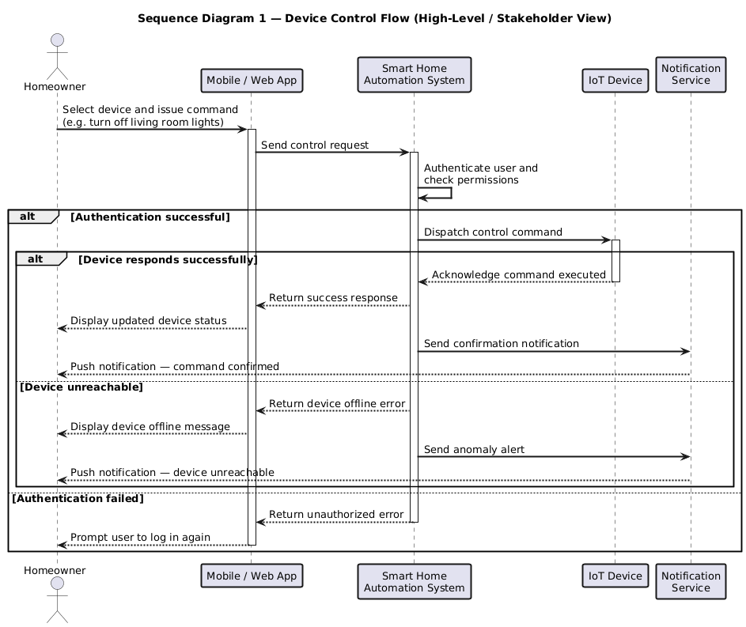

***

#### Sequence Diagram 2 — Device Control Flow (Detailed / Developer View)

Shows JWT validation, Redis cache reads and writes, Zigbee frame dispatch, HTTP status codes, and Automation Engine notification on state change.

**Key design decision:** Cache is read before the database is written because the cache reflects the most current live state. The database write happens only after the IoT device acknowledges the command.

**Diagram:** `uml/sd2_device_control_detailed.puml`

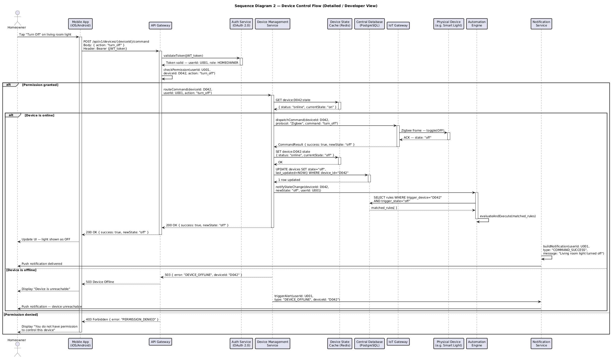

***

#### Sequence Diagram 3 — Automation and AI Trigger Flow (Detailed)

Models the fully autonomous background flow. No human initiates this sequence — a physical sensor triggers the entire chain.

**Diagram:** `uml/sd3_automation_detailed.puml`

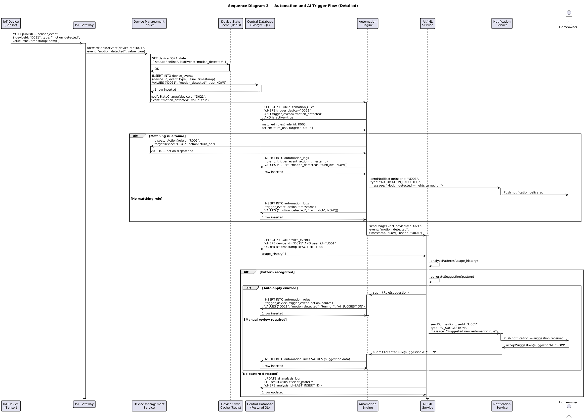

***

#### Sequence Diagram 4 — User Registration and Device Onboarding (Detailed)

Covers the full lifecycle from registration form submission through email verification to IoT device handshake.

**Diagram:** `uml/sd4_onboarding_detailed.puml`

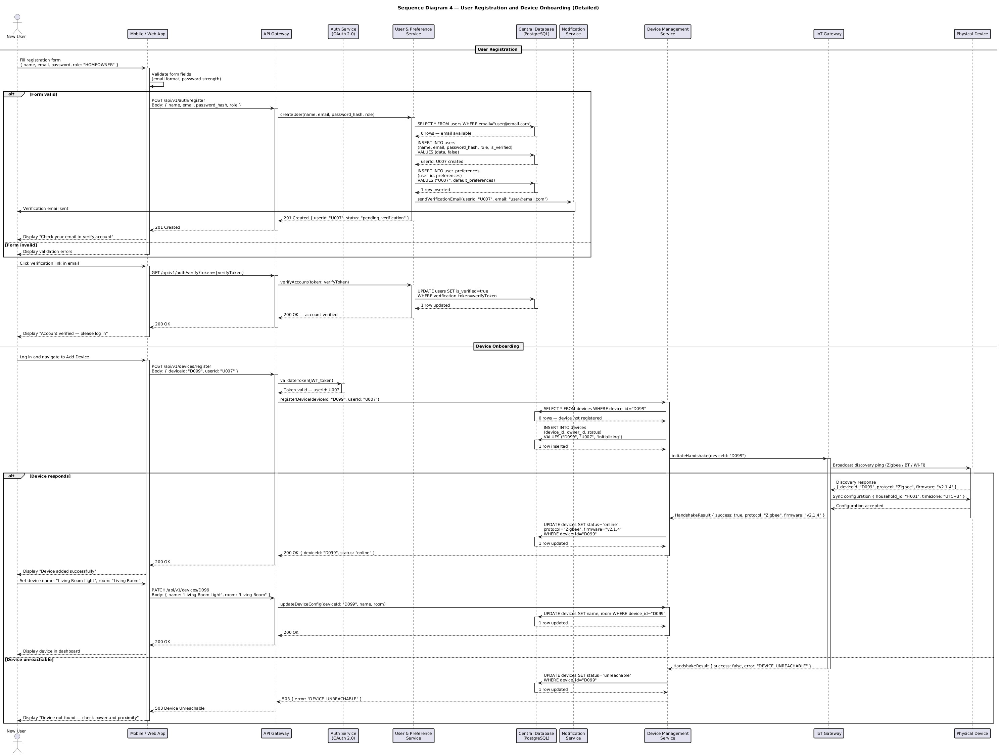

***

#### Sequence Diagram 5 — Alert and Incident Response Flow (Detailed)

Models the safety-critical path including emergency rule execution, false alarm handling, and AI threshold recalibration.

**Diagram:** `uml/sd5_alert_detailed.puml`

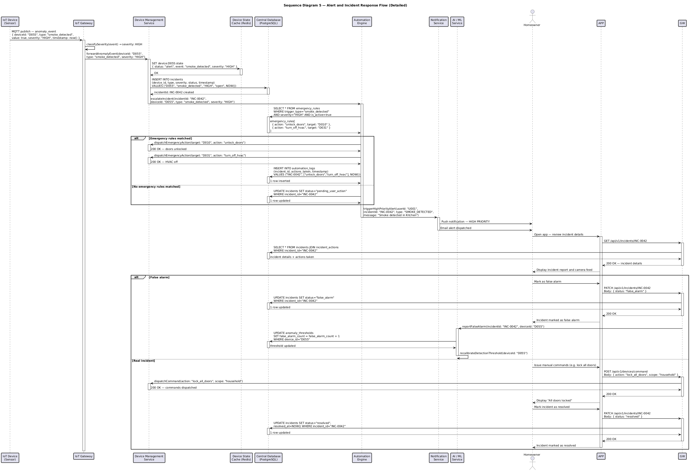

***

#### Sequence Diagram 6 — Manage Family Members (Detailed)

Models the permission propagation chain from User & Preference Service to Device Management Service access control lists.

**Diagram:** `uml/sd6_family_member_detailed.puml`

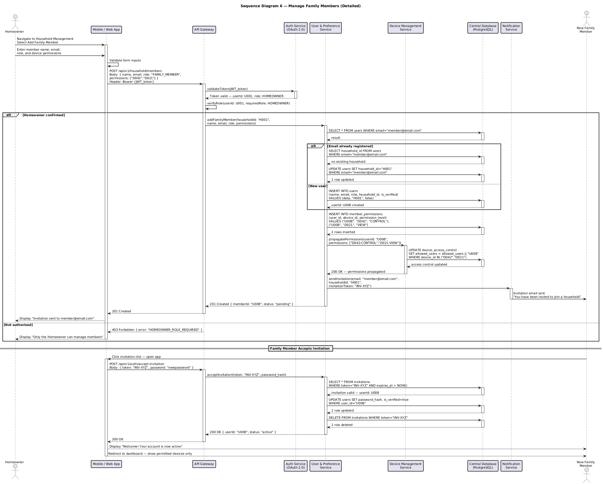

***

#### Sequence Diagram 7 — System Administrator Monitoring and Configuration (Detailed)

Models a fundamentally different access pattern — no IoT layer, direct backend service access via admin-only endpoints.

**Diagram:** `uml/sd7_admin_detailed.puml`

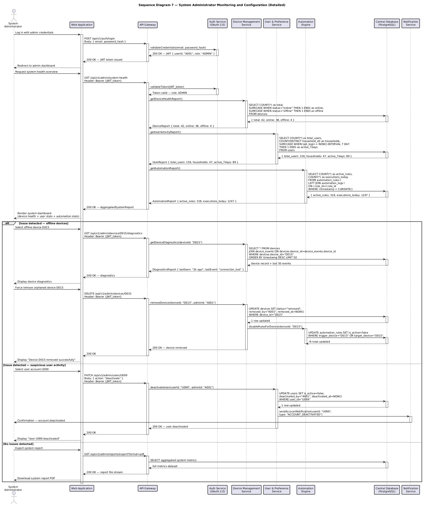

***

## 4. Part III — Structure

### 4.1 Class Diagram

The class diagram models the static structure of the Smart Home Automation System — all domain entities, their attributes and operations, and the relationships between them. Every class was derived directly from entities that appeared in the sequence and activity diagrams, ensuring full consistency across all UML layers.

**Classes and their source:**

| Class | Derived From |
|---|---|
| User (abstract) | All SDs — base class for all human actors |
| Homeowner | C4 L1, UC1, AD1–AD6 |
| FamilyMember | C4 L1, UC1, AD5, SD6 |
| Administrator | C4 L1, UC2, AD6, SD7 |
| Household | SD4, SD6 |
| Device | All SDs — core domain entity |
| DeviceState | SD2, SD3, SD5 |
| Permission | SD6 — member_permissions table |
| AutomationRule | AD2, SD3 |
| AutomationLog | SD3, SD7 |
| AIModel | AD2, SD3 |
| AISuggestion | SD3 — suggestionId: S009 |
| Incident | AD4, SD5 |
| Notification | All SDs |
| Preference | AD5, SD6 |
| Invitation | AD5, SD6 |

**Relationships:**

| Relationship Type | Between |
|---|---|
| Generalization (Inheritance) | User ◁— Homeowner, FamilyMember, Administrator |
| Composition | Household ◆— Device, User ◆— Preference, Device ◆— DeviceState, AutomationRule ◆— AutomationLog, FamilyMember ◆— Permission |
| Aggregation | Household ◇— User |
| Association | AutomationRule → Device, Incident → Device, Notification → User, AIModel → AISuggestion, AISuggestion → AutomationRule, Permission → Device, Homeowner → Invitation, Invitation → FamilyMember |

**Why User is abstract:** You never instantiate a plain User — every person in the system is either a Homeowner, FamilyMember, or Administrator. Making it abstract enforces this constraint and correctly models the inheritance hierarchy.

**Why Composition for Household ◆— Device:** A Device cannot exist independently — it must belong to a Household. If the Household is deleted, its devices are deleted too.

**Why Aggregation for Household ◇— User:** A User can exist in the system independently of a Household — they have an account before accepting an invitation. The parts can outlive the whole.

**Why AISuggestion is a separate class from AutomationRule:** In SD3 we explicitly modeled a suggestion object with its own ID that the user accepts or rejects. It only becomes an AutomationRule after acceptance — they are two distinct entities.

**Diagram:** `uml/class_diagram.puml`

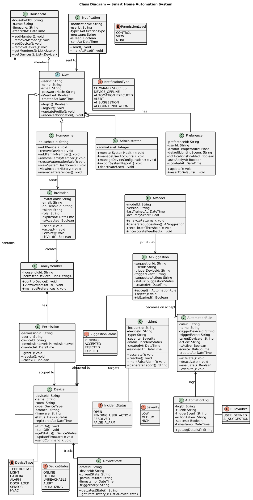

***

## 5. Part IV — Behavior

The Smart Home Automation System is classified as a **hybrid system** — it exhibits both event-driven and data-driven behavior:

- **Event-driven dimension:** IoT sensors fire events, devices transition between states, the Automation Engine reacts autonomously to those events
- **Data-driven dimension:** User data, device configuration, and usage history flow through the system and are processed, stored, and transformed into outputs like reports and AI suggestions

Accordingly, two behavioral models are provided: a State Diagram for the event-driven dimension, and a Data Flow Diagram for the data-driven dimension.

***

### 5.1 State Diagram — Device Lifecycle

The state diagram models the complete lifecycle of a Device entity — the most architecturally significant entity in the system because it is at the center of every operational flow.

**States:**

| State | Description |
|---|---|
| Unregistered | Device exists physically but has not been added to the system |
| Initializing | Device is being onboarded — IoT Gateway handshake in progress |
| Online | Device is registered and connected. Contains two substates: Idle and Executing |
| Idle | Device is online and ready — no active command |
| Executing | Device is actively processing a dispatched command |
| Unreachable | Device is registered but not responding to communication |
| Alert | Device has detected an anomaly or triggered an incident |
| Maintenance | Device has been flagged for inspection or firmware update |
| Removed | Device has been deregistered — terminal state |

**Why Online is a composite state:** `Online` contains `Idle` and `Executing` as substates. This is the correct UML modeling because these two substates only exist in the context of a connected device — they have no meaning outside `Online`.

**Why Alert transitions to Maintenance and not directly to Removed:** A safety-critical system should never automatically remove a device that is generating alerts — the sensor itself may need physical inspection. A human decision is required before removal, enforced by routing through Maintenance first.

**Why Removed is terminal:** Once deregistered, all state history and rules are archived. Re-adding the same physical device starts a brand new lifecycle from Unregistered.

**Diagram:** `uml/state_diagram_device.puml`

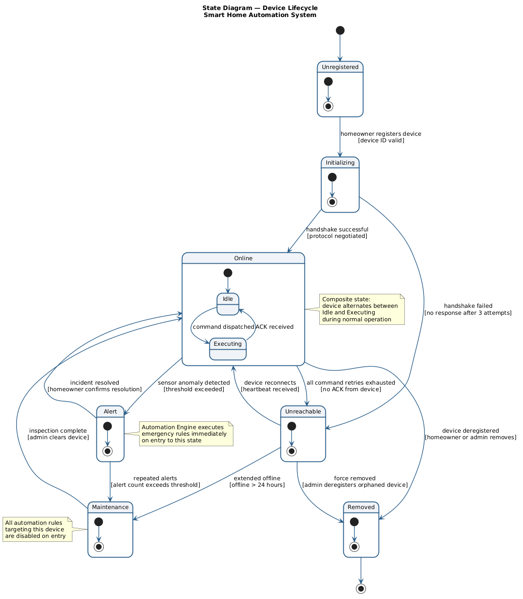

***

#### State-Stimulus Table

| Current State | Stimulus / Event | Next State | Action Taken |
|---|---|---|---|
| Unregistered | Homeowner registers device ID | Initializing | IoT Gateway initiates handshake |
| Initializing | Handshake successful | Online | Device status set to Online in DB and cache |
| Initializing | Handshake failed | Unreachable | Device status set to Unreachable, user notified |
| Online / Idle | Command dispatched | Online / Executing | Device Management Service forwards command to IoT Gateway |
| Online / Executing | ACK received from device | Online / Idle | State updated in cache and DB, user notified |
| Online / Executing | All retries exhausted | Unreachable | Failure reported, anomaly alert triggered |
| Online | Sensor anomaly detected | Alert | Automation Engine executes emergency rules, alert dispatched |
| Online | Admin or Homeowner deregisters | Removed | Device record soft-deleted, rules disabled |
| Alert | Homeowner resolves incident | Online | Incident marked resolved, AI feedback logged |
| Alert | Homeowner marks false alarm | Online | Incident marked false alarm, AI threshold recalibrated |
| Alert | Alert count exceeds threshold | Maintenance | Device flagged, rules disabled, admin notified |
| Unreachable | Heartbeat received | Online | Device status updated in cache and DB |
| Unreachable | Offline > 24 hours | Maintenance | Device flagged, admin notified |
| Unreachable | Admin force removes | Removed | Device record soft-deleted, rules disabled |
| Maintenance | Admin clears device | Online | Device status restored, rules re-enabled |
| Removed | — | — | Terminal state — no further transitions |

***

### 5.2 Data Flow Diagram

The DFD models the data-driven dimension of the system — how data enters, gets processed, gets stored, and produces outputs. The DFD intentionally excludes event-driven flows (device commands, automation triggers, incident response) which are already covered by the State Diagram and Activity Diagrams.

The DFD focuses exclusively on the **data management pipeline**: user and household data, device configuration data, AI learning data, and system reporting.

#### DFD Level 0 — Context

Shows the entire data pipeline as a single process with external entities and data flows in and out.

**External Entities:**

- **Homeowner / Family Member** — provides registration data, preferences, profile updates; receives personalized responses, AI suggestions, usage reports
- **IoT Devices** — provides sensor readings, device telemetry, configuration data; receives configuration sync and firmware updates
- **System Administrator** — provides management requests; receives system health reports and analytics

**Diagram:** `uml/dfd_l0_context.puml`

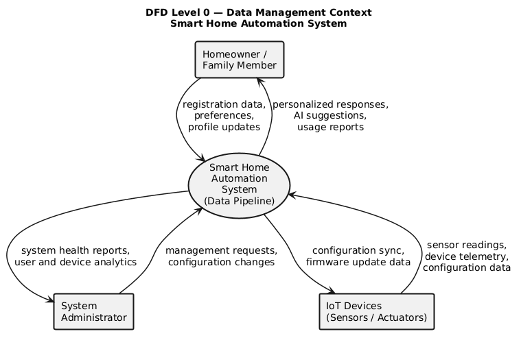

***

#### DFD Level 1 — Data Management Pipeline

Breaks the system into four focused data management processes:

| Process | Description |
|---|---|
| P1 — Manage User & Household Data | Handles registration, profile updates, preferences, and family member management |
| P2 — Manage Device & Configuration Data | Handles device registration, telemetry storage, configuration sync, and firmware tracking |
| P3 — AI Learning Data Pipeline | Reads usage history and preferences, trains the AI model, generates and stores automation suggestions |
| P4 — Generate Reports & Dashboards | Aggregates data from all stores and produces usage dashboards and system health reports |

**Data Stores:**

| Store | Contents |
|---|---|
| D1 — Users & Preferences | User accounts, roles, preferences, notification settings |
| D2 — Devices & Configurations | Device records, protocols, firmware versions, room assignments |
| D3 — Usage History & Events | Processed behavior patterns and device event history |
| D4 — AI Model & Suggestions | Trained model data and generated automation suggestions |
| D5 — Reports & Logs | Generated system reports and audit logs |

**Why Device State Cache is excluded from the DFD:** The Redis cache is a real-time infrastructure component that supports the event-driven command flow — it is not part of the data management pipeline. It is correctly represented in C4 L2 as a separate container and in the sequence diagrams as a participant.

**Diagram:** `uml/dfd_l1_pipeline.puml`

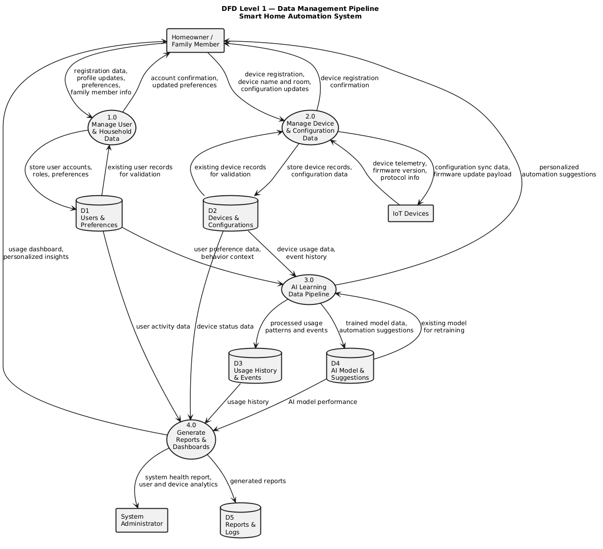

***

## 6. Design Decisions and Assumptions

| # | Decision / Assumption | Justification |
|---|---|---|
| 1 | Guest User excluded from actor model | The system is modeled as private to registered household members only |
| 2 | Family Member defined as a distinct actor from Homeowner | Case study mentions per-user preferences — implies individual profiles with different permission scopes |
| 3 | AI/ML Module treated as external at C4 L1 and internal at C4 L2 | At L1 the system is a black box. At L2 the case study describes AI as an integrated module |
| 4 | IoT Gateway modeled as a separate container | Physical devices speak Zigbee/MQTT; the backend speaks HTTP/REST. Protocol translation is a distinct architectural concern |
| 5 | Redis cache introduced for device state | Real-time dashboards require sub-millisecond state reads. Polling PostgreSQL directly is architecturally unsound for IoT systems |
| 6 | Actor-to-package associations used in use case diagrams | With 17 use cases and 5 actors, individual lines produce an unreadable diagram. Package-level associations are a documented professional practice |
| 7 | Six activity diagrams provided instead of one | Complete actor coverage requires separate diagrams for Family Member (AD5) and System Administrator (AD6) flows |
| 8 | System classified as hybrid | The system has both significant event-driven behavior (IoT sensors, device state transitions) and data-driven behavior (AI pipeline, reporting) |
| 9 | DFD scoped to data management pipeline only | Event-driven flows are already covered by State Diagram and Activity Diagrams. Mixing them into the DFD would produce an inaccurate and unreadable diagram |
| 10 | Device State Cache excluded from DFD | Redis is a real-time infrastructure component supporting the event-driven layer — not part of the data management pipeline modeled by the DFD |
| 11 | User is an abstract class | No plain User is ever instantiated — every person is a Homeowner, FamilyMember, or Administrator |
| 12 | AISuggestion modeled as separate class from AutomationRule | A suggestion has its own lifecycle and ID — it only becomes a rule after user acceptance |

***

## 7. Traceability Matrix

### Actor Coverage

| Actor | C4 L1 | C4 L2 | Activity Diagram | Use Case Diagram | Sequence Diagram | Class Diagram |
|---|---|---|---|---|---|---|
| Homeowner | ✅ | ✅ | AD1,3,4,5,6 | UC1 | SD1,2,4,5,6 | ✅ |
| Family Member | ✅ | ✅ | AD5 | UC1 | SD6 | ✅ |
| System Administrator | ✅ | ✅ | AD6 | UC2 | SD7 | ✅ |
| Automation Engine | — | ✅ | AD2,4 | UC2 | SD3,5 | — |
| AI/ML Service | — | ✅ | AD2,4 | UC2 | SD3,5 | ✅ AIModel |

### Container Coverage

| Container | Activity Diagram | Sequence Diagram |
|---|---|---|
| Mobile / Web App | AD1,3,5,6 | SD1,2,4,5,6,7 |
| API Gateway | AD1,3,5,6 | SD2,4,5,6,7 |
| User & Preference Service | AD3,5 | SD4,6,7 |
| Device Management Service | AD1,2,3,4,5 | SD2,3,4,5,6,7 |
| Automation Engine | AD2,4,6 | SD2,3,5,7 |
| Notification Service | AD2,3,4,5 | SD2,3,4,5,6,7 |
| IoT Gateway | AD1,2,3,4 | SD2,3,4,5 |
| AI/ML Service | AD2,4 | SD3,5 |
| Central Database | All ADs | All SDs |
| Device State Cache | AD1,2,4 | SD2,3,5 |

### Use Case Coverage

| Use Case | Activity Diagram | Sequence Diagram | Class Diagram |
|---|---|---|---|
| UC-01 Log In | AD3 | SD4 | User hierarchy |
| UC-02 Control Device | AD1 | SD1, SD2 | Device, DeviceState |
| UC-03 Add/Remove Device | AD3 | SD4 | Device, Household |
| UC-04 Create Automation Rule | AD2 | SD3 | AutomationRule |
| UC-05 Manage Family Members | AD5 | SD6 | FamilyMember, Permission, Invitation |
| UC-06 Trigger Alert | AD4 | SD5 | Incident, Notification |
| UC-07 Execute Automation Rule | AD2 | SD3 | AutomationRule, AutomationLog |
| UC-08 Generate AI Suggestion | AD2 | SD3 | AIModel, AISuggestion |

### Behavior Coverage

| Diagram | Behavioral Dimension | Traces To |
|---|---|---|
| State Diagram — Device | Event-driven | AD1, AD4, SD2, SD5 |
| DFD L0 | Data-driven context | C4 L1 |
| DFD L1 | Data-driven pipeline | AD3, AD5, SD4, SD6, SD7 |
